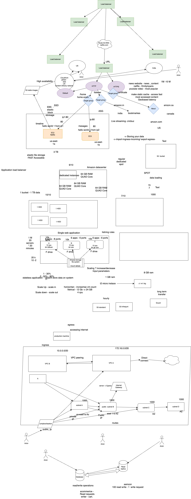

# AWS Mentoring Session Notes

## Virtual Private Cloud (VPC)

### IP Addressing (CIDR Blocks) reserved for private IPs

- `10.0.0.0/8`: Private IP range from `10.0.0.0` to `10.255.255.255`
- `172.16.0.0/12`: Private IP range from `172.16.0.0` to `172.31.255.255`
- `192.168.0.0/16`: Private IP range from `192.168.0.0` to `192.168.255.255`

- **Subnet Calculator**: [mxtoolbox.com/subnetcalculator.aspx](https://mxtoolbox.com/subnetcalculator.aspx)

- **VPC**: A VPC can be divided into multiple subnets. 
  like 4000 IP's can be divided into 4 subnets - 1000,1000,1000,1000

- **Private subnet**: Subnet has 1000's IP. cannot access internet from the VM

- **Public subnet**: Subnet has 1000's IP. can access internet from the VM. since attached to the internet gateway

- **Bastion host**: Can be used to access a private network from extenal network.

- **Internet Gateway** : to attach to the subnet.

### Auto Scaling

- **Region**: us-east-1
- **Availability Zone (AZ)**: us-east-1a

#### Instance Types

- **On-Demand**: Regular on shared hardware
- **Spot Instances**: Utilize leftover VM capacity. Can be interrupted in the middle. Not recommended for production-grade apps.
- **Dedicated**: Hardware with vendor license lock

#### Firewall

- **Security Group**
  - Traffic can be allowed to a specific EC2 instance based on port (e.g., port 80, port 22, port 443 as Ingress)
  - You cannot block a particular port in Security Groups (SGs).

- **Network Access Control Lists (NACLs)**
  - Controlled at the subnet level
  - Rules based on priority (e.g., 100, 101, 102, 103)
    - Example:
      - 101: Allow port 80
      - 102: Allow port 443
      - 103: Block port 80
    - Final outcome based on priority: Rule 101 allows port 80

## AWS Services

### S3 (Simple Storage Service)

- SLA: 99.999999% uptime
- Glacier: $1,400 per month cost
- Standard: $11,300 per month cost

### EFS (Elastic File System)

- Network file system-based
- Shared file system
- Can be mounted as F-drive

### EBS (Elastic Block Storage)

- VM-based storage HDD
- Costly

### Difference between EBS & S3 & EFS

## AWS Features and Tools

### CloudFront

- CDN for static cache and fast access
- Edge location geobased latency optimization
- Charged for Data transfer/requests

### instance types

  - t2 micro, t2.large, C1.large

### AutoScaling

- Increase/decrease the resources capacity based on parameters such as 50% CPU. Scale down when instance usage drops to 30% CPU usage.
- Zero charges, charges only for instances.

### Horizontal Scaling

- Scaling Out & Scaling In
- Increase/decrease the number of VMs

### Vertical Scaling

- Scaling Up & Scaling Down
- Upgrade the VM size from t2.micro to t2.large

### Load Balancing

- **Application Load Balancer**
  - Listeners: 80, 443
  - Listeners rules: Redirects traffic based on website URL (e.g., payments.amazon.com to target A, electronics.amazon.com to target B)
  - Targets: Can be an instance or IP

- **Network Load Balancer**
  - Distributes traffic to multiple VM points during high traffic
  - Charges for the whole duration it's spun up

### Batch/Job as a Service

- Run functions without infrastructure management
- Example: Processing images on EC2 and storing results in S3

### AWS Lambda

- Function as a Service (FaaS) with serverless architecture
- Event-driven triggers for S3, monitoring, scheduling tasks
- Cron/scheduled tasks (e.g., database backups to S3)
- Automation triggers based on file uploads or other events

## Database Services

### RDS (Relational Database Service)

- Regular scalability considerations (replication, sharding)
- Upgrades (e.g., Oracle 11g to 13g, MySQL 5 to 8)
- AWS Managed database provides feasibility and handling on AWS infra without needing user intervention.
- Can schedule maintenance windows.
- Read Replicas: Only read requests go to replicas, write requests go to the actual DB

## Automation and Infrastructure Management

- **CloudFormation** / **Terraform**
  - Infrastructure as Code (IaC) for managing AWS resources

